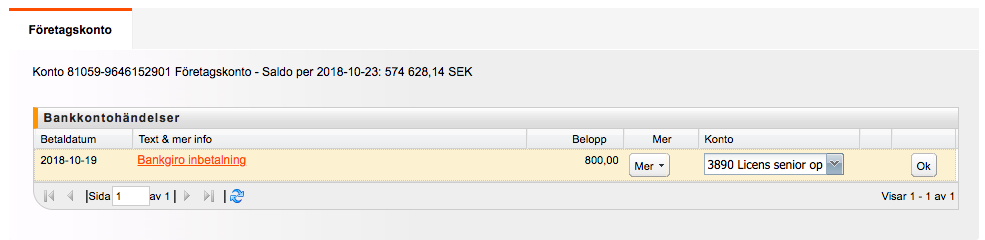
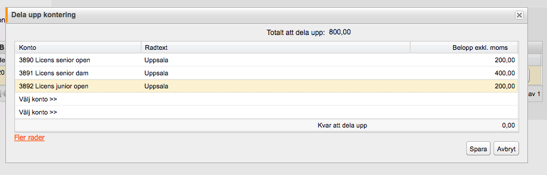

# Löpande bokföring

Hej,

Kopplingen fungerar perfekt och det enda som egentligen behöver matas in är:

* uppdatering kontoplan och behöver bara göras vid enstaka tillfällen

* vid inbetalning där man vill kunna dela upp en inbetalning till olika konton

Så här ser det när jag bokför, SpeedLedger föreslår konto och om det stämmer klickar man på OK

Om jag vill dela upp en inbetalning på olika konton ser det ut så här

