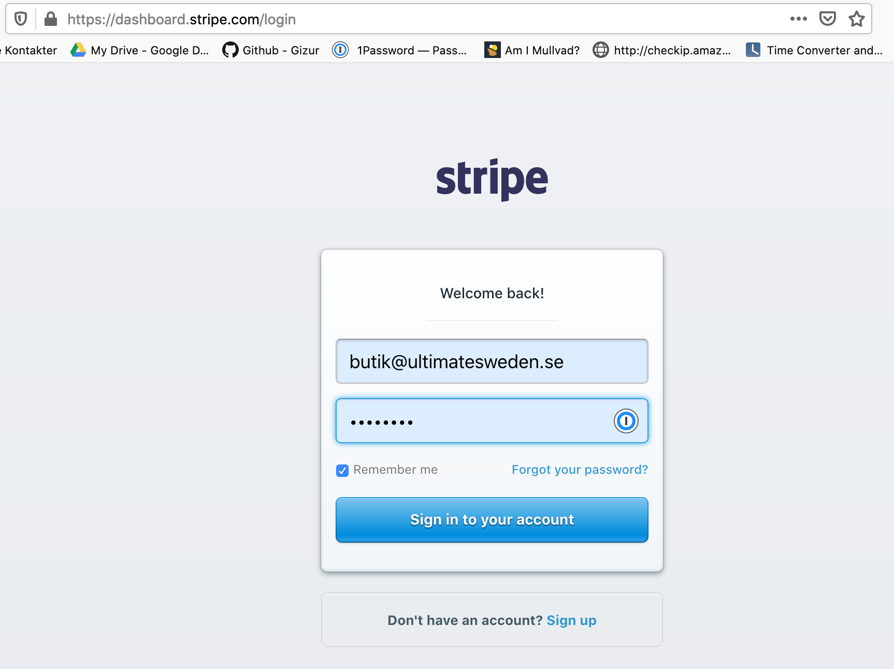
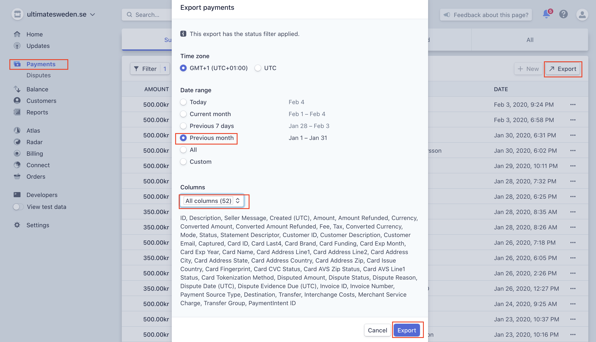

# Ekonomi landslag

Det finns fyra landslagsgrupper: UL, U24, Senior och Masters vars ekonomier hanteras separat med egna bankkonton. 

* ansvarig för respektive landslagsgrupp godkänner leverantörsfakturor som betalas från dessa bankkonto. Kansliet mailar respektive grupp för godkänande (mail-adresser finns på [organisations-sidan](./organisation.html) )
* kostnaden bokas på respektive landslagsgrupps konto (se kontoplan 2020 i Google Drive) och betalas från dess bankkonto
* ansvarig respektive landslagsgrupp säkerställer att kundfakturor ställs ut genom att ge faktureringsppdrag till kansliet
* inbetalningar bokas som intäkt på respektive landslagsgrupps konto (se kontoplan 2020 i Google Drive)

*VIKTIGT!* Utbetalningar för landslag kan endast godkännas av en landslagsgreupp då det finns tillräckliga medel på för respektive landslagsgrupps konto. Om en landslagsgrupp har behov av att långa pengar görs detta enligt rutinen nedan.

Följande Swishkonton finns att tillgå. Kontakta styrelse om det finns behov av ytterligare swishkonton.


| Swish-nummer  | Lag                                 | Anslutningskonto     | 
|---------------|-------------------------------------|----------------------|
|123 335 26 63	| u17 Open                    	      | 8105-9,704 108 191-5 |
|123 209 06 52	| u20 Dam                             |	8105-9,704 108 191-5 |	
|123 236 30 59	| u20 Open                            |	8105-9,704 108 191-5 |	
|123 448 99 93	|	Senior Dam                          | 8105-9,704 108 194-9 |
|123 561 06 54	| Senior Herr                         | 8105-9,704 108 194-9 |
|123 260 24 31	| Senior Mixed                        | 8105-9,704 108 194-9 |
|123 631 54 93	| U24         	                      | 8105-9,704 108 193-1 |
|123 686 19 18	|	Master (Master, GM, GGM)            | 8105-9,704 108 195-6 |
|123 562 22 20	|	SUF                                 | 8105-9,964 615 290-1 |


## Lån mellan SUF och landslagsgrupper

Lån från SUF till landslag ska godkännas av SUF:s styrelse. Alla lån och återbetaningar mellan SUF och landslagsgrupper ska registreras i Google Sheetet 'Lån till landslagsgrupper' som finns i Google Driven Ekonomi. Kansliet gör detta när överföringen görs till/från respektive konto för landslagsgruppen.

# Utbetalningar

Utbetalningar från SUF görs då giltigt bokföringsunderlag presenteras. Exempel på underlag är faktura, kvitton, underlag för skatteinbetalningar, redovisning av körda mil för milersättning samt redovisning för uttag av traktamente. Kansliet skall  säkerställa att giltigt bokföringsunderlag finns då utbetalningar görs. Om detta saknas ska kansliet tillfråga styrelsen och avvakta med utbetalningen tills gilitiga underlags presenterats. Om det är osäkert om underlag är giltigt skall revisorn rådfrågas. Pengar som betalats ut där giltiga bokföringsunderlag underlag saknas skall omedelbart betalas tillbaka.


# Kundfakturor

Kansliet ansvarar för fakturering inom SUF. Detta inkluderar licenser, föreningsavgifter och andra faktureringsuppdrag som styrelsen ger kansliet. Betalningsfristen ska vara 30 dagar om inget annat anges i faktureringsuppdraget. Påminnelsefakturor ska skickas då betalningar inte görs i tid. Dröjesmålsränta på 8% (per år) ska tas ut samt ett påminnelseavgift på 60 Kr vid varje påminnelse. Ytterligare påminnelser skickas after 30 dagar tills dess att betalnings gjorts.


# Löpande bokföring

Det finns en automatiskt koppling mellan Swedbank och SpeedLedger. Det enda som behöver matas in manuellt är:

* uppdatering kontoplan och behöver bara göras vid enstaka tillfällen

* vid inbetalning där man vill kunna dela upp en inbetalning till olika konton

Så här ser det när jag bokför, SpeedLedger föreslår konto och om det stämmer klickar man på OK


Om jag vill dela upp en inbetalning på olika konton ser det ut så här


faktura@ultimatesweden.se


## Stripe

Kortbetalningar som gjorts via hemsidan överförs automatiskt från Stripe (betalningsleverantören) till SUF:s bankkonto. Kansliet ansvarar för att föra över betalningarna till respektive landslagsgrupps bankkonto. Det är viktigt att det framgår i betalningarna vilket landslag betalning hör till. Stripe-betalningar ska bokföras tillsammans med övriga verifikat vi slutet av månaden.




1. Logga in och välj Payments och sedan Export.

2. Välj senaste månaden och alla kolumner och sedan export.




# Leverantörsfakturor 

SUF:s leverantörsfakturor hanteras av kansliet. Fakturor skickas via mail till 
faktura@ultimatesweden.se eller om det inte är möjligt med post till fakturaadressen. Leverantörsfakturor som kommer med post scannas in av kansliet och mailas till faktura@ultimatesweden.se. På detta sätt får styrelsen veta att fakturan kommit och den sparas även automatiskt på Google Drive. 

Fakturor som ska belasta projekt ska ha en projektkod som referens som projekten tilldelas när de godkänns. 

Kansliet mailar för attest av fakturor. Mailet ska innehålla belopp och konto som kostnaden ska tas på (alt. en fråga om  kansliet inte vet vilket konto en faktura ska belasta).

Fakturaadress:

```
Svenska Ultimateförbundet
Gullbergs Strandgata 36D
411 04 Göteborg
```

## Betalning av leverantörsfakturor

Betalningar får endast göras till godkända levertantörer. Registerutdrag för godkända leverantörer finns på Google Drive [Ekonomi](https://drive.google.com/drive/folders/1rzow1bCGvufOQIUeFHirGzi2CB_YC1XM). Om det saknas registerutdrag ska detta göras innan betalning görs.

Om det kommer in fakturor som inte är godkända ska mail skickas till faktura@ultimatesweden.se för att få leverantören godkänd.

Fakturor som belastar utvecklingsplanen ska vara försedda med en referens till en projektkod. Giltiga projektkoder finns på [Google Drive](https://drive.google.com/drive/folders/0AP8_MerwYwMTUk9PVA)


## Nya leverantörer

Alla leverantörer som SUF använder sig av måste vara registrerade som arbetsgivare. Detta kontrolleras enkelt på [skatteverkets hemsida](https://www.skatteverket.se/privat/sjalvservice/allaetjanster/tjanster/hamtaforetagsinformation.4.3810a01c150939e893f3e69.html)

Info om F-skatt och sociala avgifter för enskild firma finns [här](https://www.skatteverket.se/foretagochorganisationer/sjalvservice/svarpavanligafragor/nystartadeforetag/foretagfskattfaq/jagharstartatettforetaghurbetalasminasocialavgifteromjagharfskatt.5.10010ec103545f243e8000709.html). 


# Rapportering

Inmatning av verifikat ska vara gjort senast 5 arbetsdagar efter månadens slut. När alla verifikat är
Inlagda ska en resultat- och balansräkning läggas upp Google Drive Ekonomi i mappen Rapporter. Även en huvudbok ska tas ut och läggas i mappen Rapporter.


