# Hemsida

Hemsidan (http://ultimatesweden.se) används för att sprida information försäljning och även att ta in anmälningar och betalningar till olika event.

I tillägg till hemsidan som är synlig för medlemmarna finns en testmiljö och en utvecklingsmiljö. Dessa kan användas om man vill testa
ny funktionalitet eller bara lära sig lite om Wordpress och WpForms. Maila hemsida@ultimatesweden.se om du har frågor kring detta.


## Formulär - WpForms

WpForms gör det enkelt att sätta upp formulär som kan användas för att ta in anmälningar och även betalningar.


### Se formulär/anmälningar/betalningar


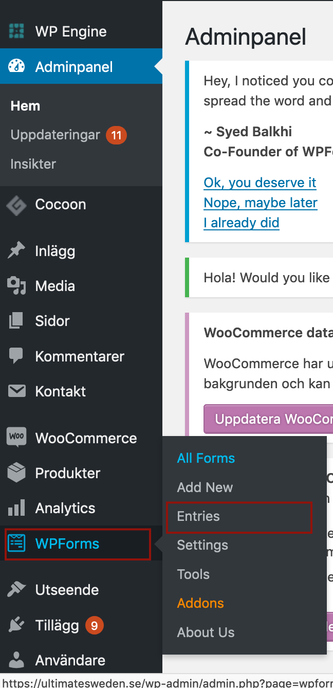

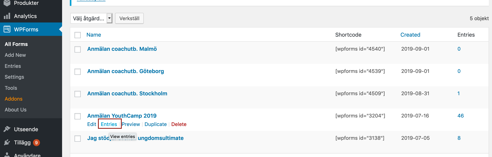

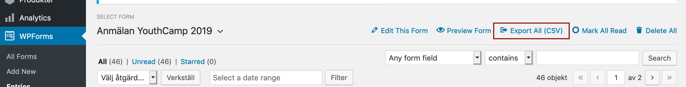


### Skapa ny sida med formulär

Ett enkelt sätt att skapa en sida med ett formulär i är att kopiera en existerande sida.

1. Börja med att kolla vilket ID det formulär som ska användas har (vi förutsätter att formuläret redan finns). Välj menyvalet 'All Forms'

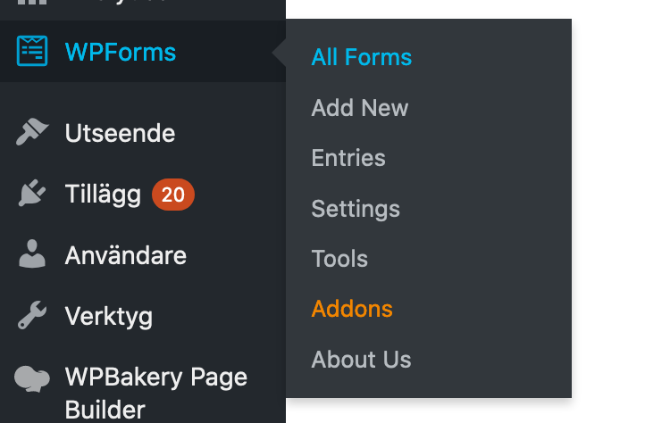

2. Kontrollera vilket ID som det formulär du vill använda har i listan med formulär, t.ex. ```[wpforms id="XXXX"]```

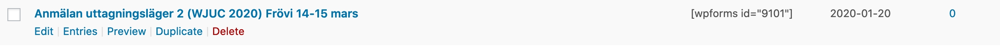

3. Välj sedan listan med alla sidor

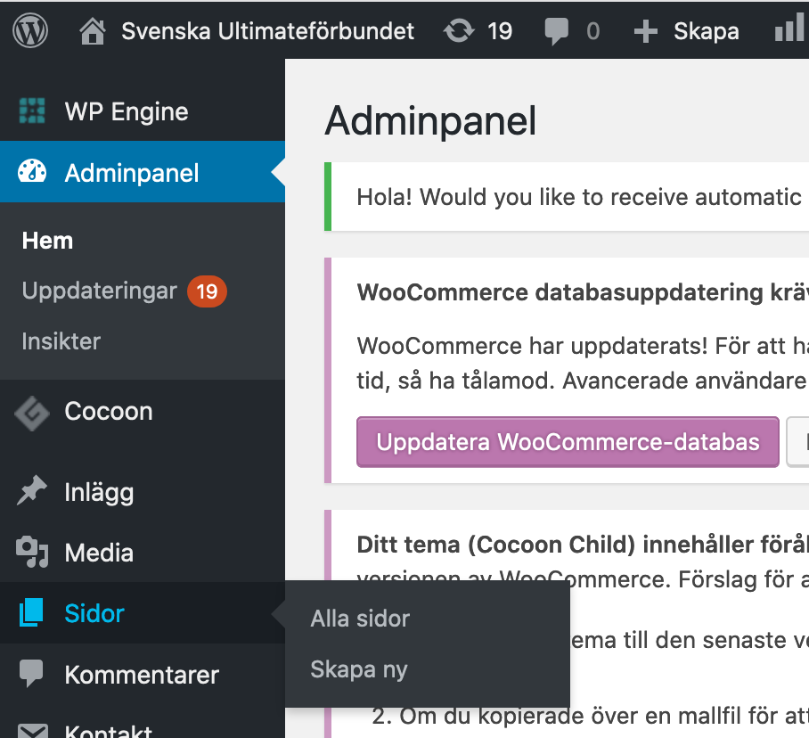

4. Duplicera en sidan som liknar den sida du vill skapa

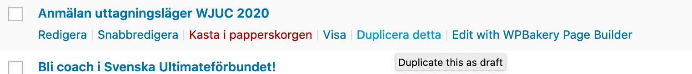

5. Välj Redigera för denna sida

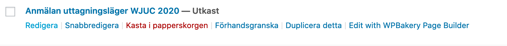

6. Ändra ID i sektionen ```[wpforms id="XXXX" ...]```. Ändra övrig text.

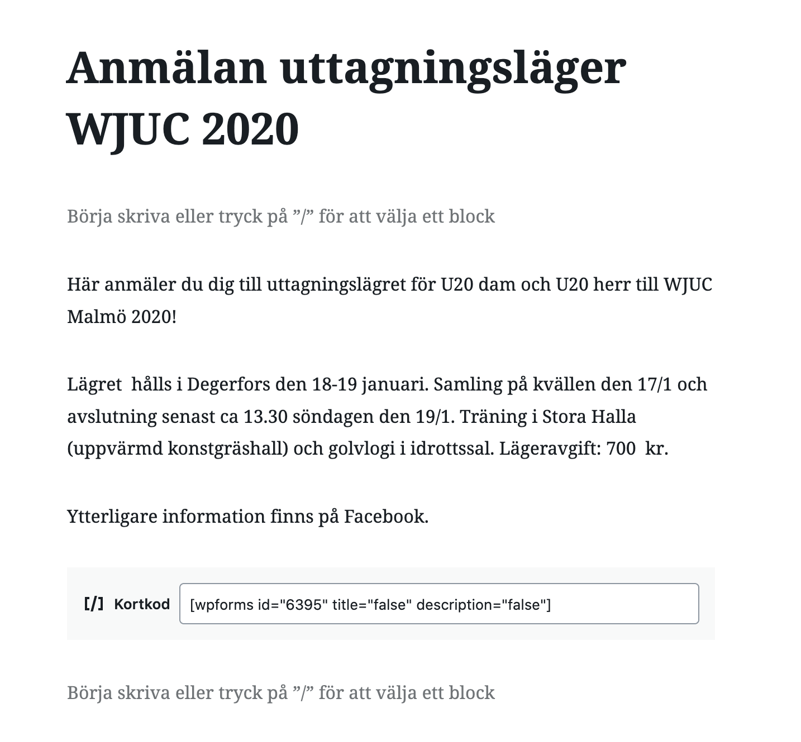

7. Publicera sidan

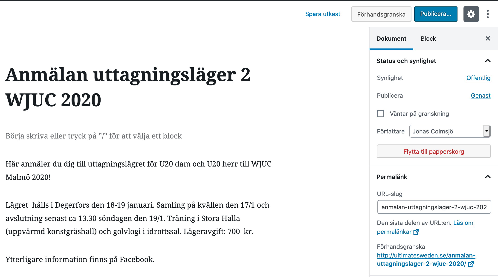

8. Uppdatera menyerna

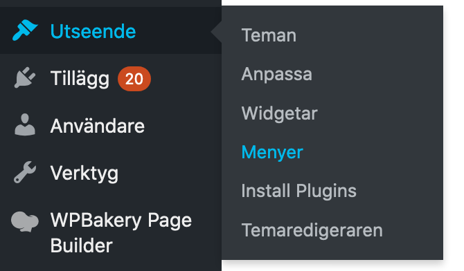

9. Välj sidan du skapade och sedan 'Lägg till i meny'

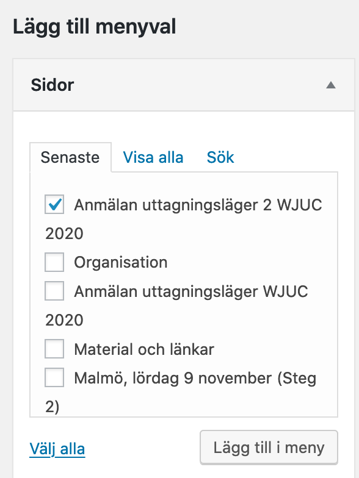


## Betalningar - Stripe

Tjänsten Stripe används för att ta in betalningar. WpForms integrerar med Stripe och det finns ett en färdig Stripe-modul som kan användas i formulär. Maila hemsida@ultimatesweden.se om du har frågor kring Stripe.


## Mailutskick - MailChimp

SUF har ett MailChimp-konto som mailadresser automatiskt skickas till om detta sätts upp i WpForms formulär. Maila hemsida@ultimatesweden.se om du har frågor kring MailChimp.
